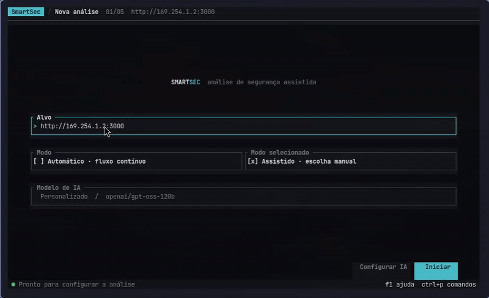
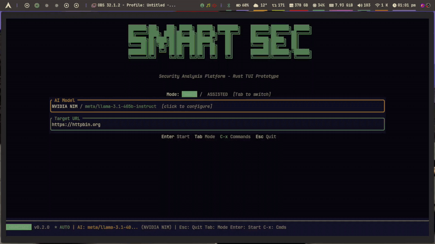
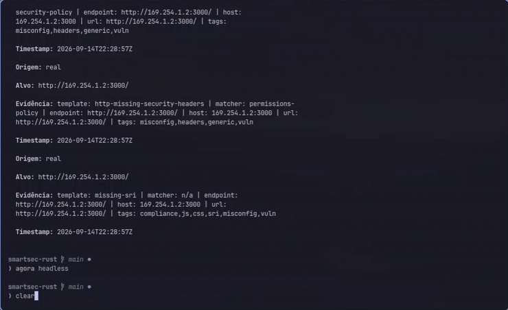

# SmartSec

Plataforma de analise de seguranca — prototipo escrito em Rust com interface de terminal.

## Documentacao do TCC

- [Especificacao completa, requisitos, sprints e metas](TCC_SPEC.md)
- [Regras para agentes, branches, PRs e Definition of Done](AGENTS.md)
- [Distribuicao atual da Sprint 1](docs/PLANO_DE_DISTRIBUICAO.md)

# Demonstracao
## Modo Assitido


## Modo Automatico


## Modo Headless (CI/CD)



## Aviso

Este e um **prototipo / prova de conceito**. A maioria das ferramentas de seguranca sao emuladas (mock), mas o **Nuclei executa de verdade** — roda o binario real contra o alvo e faz parsing dos findings a partir da saida JSON.

## Funcionalidades

- **TUI** construida com [ratatui](https://crates.io/crates/ratatui) + [crossterm](https://crates.io/crates/crossterm)
- **Modo headless** via `--auto --url <alvo>`
- **Nmap real** via Podman rootless, com portas e serviços extraídos do XML
- **Suporte a mouse** — todos os botoes e listas sao clicaveis
- **Nuclei real** — escaneia alvos usando 968+ templates de misconfiguracao, extrai findings com classificacao de severidade
- **Analise IA** (integracao com LLM — mock por padrao, suporta OpenAI / Ollama / NVIDIA NIM)
- **Exportacao de relatorio** — gera `smartsec-report.md` com findings, recomendacoes e explicacoes didaticas

## Requisitos

- Rust 1.80+
- [Podman](https://podman.io/) configurado em modo rootless
- Podman com suporte ao backend de rede rootless `pasta` (o Podman 6.1 usado
  na validacao local ja o fornece; versoes recentes removeram o backend
  obsoleto `slirp4netns`)
- [Nuclei](https://github.com/projectdiscovery/nuclei) (para escaneamento real)
- Templates do Nuclei (`nuclei -update-templates`)

O executor sempre usa `--network pasta` em containers rootless. Essa rede
mantem o isolamento do container sem exigir privilegios de root e evita o
backend removido `slirp4netns`; nao ha fallback silencioso para outro driver.

## Uso rapido

```bash
# Ajuda e versão
cargo run -- --help
cargo run -- --version

# TUI interativa
cargo run

# Headless — scan automático com relatório
cargo run -- scan --target https://httpbin.org

# Headless — executar apenas o Nmap
cargo run -- scan --target https://example.com --tools Nmap

# Executar manualmente uma ferramenta específica
cargo run -- tool Nmap --target 192.0.2.10

# Usar configuração TOML e substituir opções pela CLI
cargo run -- scan --target example.com --config ./smartsec.toml --llm ollama --model llama3.1:8b

# Para ativar o Nuclei real:
# Na TUI: C-x s → Real Nuclei → Enable → Save
# Depois execute normalmente que o Nuclei vai rodar de verdade

# Na TUI em modo assistido, marque ou desmarque Nmap com Espaco
```

## Arquitetura

```
src/
  main.rs              Ponto de entrada (CLI + TUI + headless)
  tui/                 Interface de terminal (telas, estado, eventos, mouse)
  orchestrator/        Pipeline de execucao, sandbox, parsers
  tools/               Runners das ferramentas (nuclei, mocks)
  ai/                  Agente IA (prompt LLM + analise)
  llm/                 Provedores LLM (mock, openai, ollama, nvidia-nim)
  domain/              Modelos de dados (vulnerabilidade, severidade, ferramentas)
  config/              Persistencia de configuracao (~/.config/smartsec/)
  report/              Gerador de relatorio Markdown
  utils/               Auxiliares de texto
```
## Navegacao

| Tecla     | Acao                     |
|-----------|--------------------------|
| Tab       | Alternar modo (Auto/Assistido) |
| Enter     | Confirmar / Iniciar / Rodar |
| Espaco    | Selecionar/deselecionar ferramenta |
| Esc       | Sair / Voltar            |
| C-x s     | Abrir configuracoes      |
| C-x p     | Pausar execucao          |
| C-x c     | Cancelar execucao        |
| C-x q     | Sair                     |
| Ctrl+V    | Colar do clipboard       |
| Mouse     | Clicar botoes, selecionar ferramentas, rolar listas |

## Licenca

Prototipo academico (TCC).
