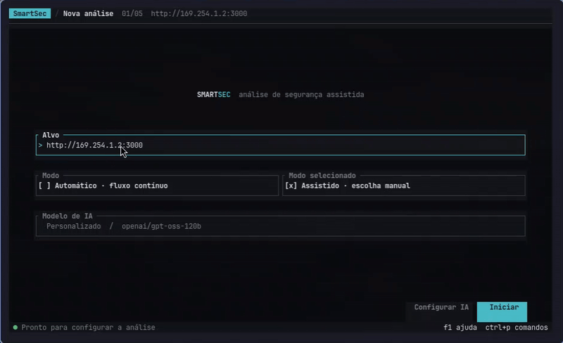
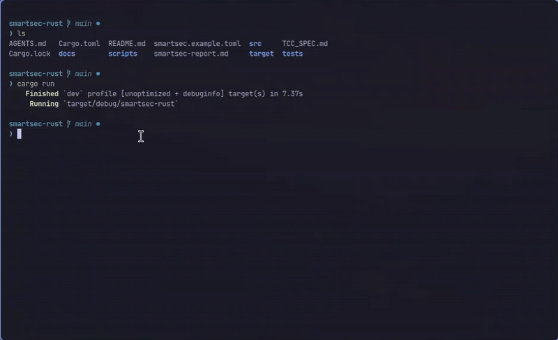
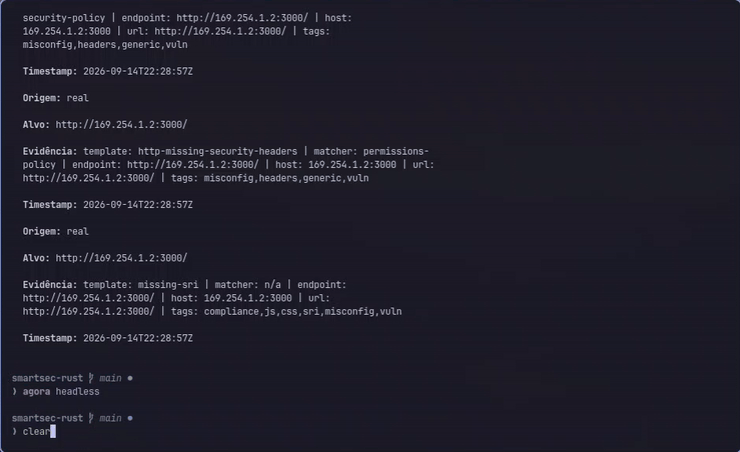

# SmartSec

Plataforma de analise de seguranca — prototipo escrito em Rust com interface de terminal.

## Documentacao do TCC

- [Especificacao completa, requisitos, sprints e metas](TCC_SPEC.md)
- [Regras para agentes, branches, PRs e Definition of Done](AGENTS.md)
- [Distribuicao atual da Sprint 1](docs/PLANO_DE_DISTRIBUICAO.md)

# Demonstracao

Video completo da demonstracao: [`docs/demo-completo.mp4`](docs/demo-completo.mp4)

## Modo Assistido (TUI)


## Decisao da IA no relatorio


## Modo Headless (CI/CD)



## Aviso

Este e um **prototipo / prova de conceito**. O catalogo atual oferece Nmap,
Nuclei e Nikto reais, executados somente em containers Podman rootless; os
binarios dos scanners nunca sao chamados diretamente no host. As demais ferramentas
previstas no TCC ainda nao fazem parte do catalogo executavel.

## Funcionalidades

- **TUI** construida com [ratatui](https://crates.io/crates/ratatui) + [crossterm](https://crates.io/crates/crossterm)
- **Modo headless** via `scan --target <alvo>`
- **Nmap real** via Podman rootless, com portas e serviços extraídos do XML
- **Suporte a mouse** — todos os botoes e listas sao clicaveis
- **Nuclei real** — imagem fixada por digest, templates montados somente-leitura e plano Nmap/IA aplicado aos argumentos
- **Nikto real** — imagem fixada por digest e relatorio JSON escrito no stdout sem shell e sem arquivo
- **Analise IA** com Ollama local por padrao e suporte a OpenAI / NVIDIA NIM
- **Exportacao de relatorio** — gera `smartsec-report.md` com findings, recomendacoes e explicacoes didaticas
- **Historico consultavel** — `smartsec history` lista as execucoes e `smartsec show <SCAN_ID>` abre uma delas, tambem pela tela de historico da TUI
- **Evidencia segura** — preserva template, matcher, endpoint, host, URL e tags, sem corpos HTTP, credenciais ou query strings

## Requisitos

- Rust 1.80+
- [Podman](https://podman.io/) configurado em modo rootless
- Podman com suporte ao backend de rede rootless `pasta` (o Podman 6.1 usado
  na validacao local ja o fornece; versoes recentes removeram o backend
  obsoleto `slirp4netns`)
- Templates do Nuclei em `~/nuclei-templates`, no commit esperado configurado; o caminho e commit podem ser definidos no TOML

O executor sempre usa `--network pasta` em containers rootless. Essa rede
mantem o isolamento do container sem exigir privilegios de root e evita o
backend removido `slirp4netns`; nao ha fallback silencioso para outro driver.
O endereco reservado `169.254.1.2` dentro dos scanners aponta para o loopback
do host. Assim, uma aplicacao autorizada publicada somente em `127.0.0.1:3000`
pode ser analisada com `--target http://169.254.1.2:3000` sem ser exposta na
rede local.

## Uso rapido

```bash
# Ajuda e versão
cargo run -- --help
cargo run -- --version

# TUI interativa
cargo run

# Headless — scan automático com relatório
cargo run -- scan --target https://httpbin.org

# Headless — executar apenas o Nmap
cargo run -- scan --target https://example.com --tools Nmap

# Executar manualmente uma ferramenta específica
cargo run -- tool Nmap --target 192.0.2.10

# Usar configuração TOML e substituir opções pela CLI
cargo run -- scan --target example.com --config ./smartsec.toml --llm ollama --model llama3.1:8b

# Escolher arquivo e diretório do relatório
cargo run -- scan --target https://example.com --output relatorio.md --output-dir ./saida

# Consultar o historico de execucoes
cargo run -- history
cargo run -- history --limit 5
cargo run -- show scan_1757000000000000000

# Na TUI em modo assistido, marque ou desmarque ferramentas com Espaco
```

### Historico de execucoes (REQ19)

Cada execucao grava um registro JSON em `~/.config/smartsec/scans/<scan_id>.json`
com os metadados, as ferramentas executadas (incluindo o trace do Podman), os
achados, as contagens por severidade, a analise da IA e as decisoes. O registro
e sanitizado antes de ser gravado.

O `scan_id` tem o formato `scan_<nanos>` e nao e adivinhavel. Por isso o modo
headless imprime o identificador ao final da execucao:

```text
  OK Log estruturado: /home/user/.config/smartsec/scans/scan_1757000000000000000.json
  OK ID da execução: scan_1757000000000000000
     consulte depois com: smartsec show scan_1757000000000000000
```

Na TUI, a tecla `h` (ou a paleta de comandos com `Ctrl+P`) abre a tela
`Histórico`. `Enter` abre o detalhe da execução selecionada, `Esc` volta para a
lista e `Esc` de novo retorna à tela de origem. A navegação funciona igualmente
por teclado e por mouse.

Regras de seguranca e de robustez:

- A consulta é **somente leitura**: nenhum artefato original é criado, reescrito
  ou removido ao listar ou abrir uma execução.
- Um `scan_id` fora do padrão `scan_<nanos>` é recusado antes de tocar o disco.
  Como o padrão não aceita `/` nem `.`, o identificador nunca resolve para fora
  de `~/.config/smartsec/scans/` (path traversal).
- Diretório inexistente e diretório vazio são mensagens diferentes.
- Registros corrompidos ou incompletos aparecem como aviso na listagem em vez de
  sumirem em silêncio; abrirlos falha com mensagem acionável em português.
- Registros gravados por versões anteriores do formato, sem os campos mais
  novos, continuam legíveis.

```bash
# Listagem com um registro corrompido semeado de propósito
printf '{quebrado' > ~/.config/smartsec/scans/scan_1757000000000000009.json
cargo run -- history
```

### Exit codes do modo headless

| Código | Significado |
|---:|---|
| 0 | nenhuma vulnerabilidade crítica |
| 1 | vulnerabilidade crítica encontrada |
| 2 | erro de configuração, de execução ou de consulta ao histórico |

O relatório e o log estruturado são gravados antes da mensagem final. Falha de
scanner retorna `2` mesmo que o relatório preserve achados; achado crítico
retorna `1` e não é tratado como erro interno.

Na consulta ao histórico, `history` retorna `0` mesmo vazio (a listagem foi
executada) e `show <SCAN_ID>` retorna `2` para identificador inválido ou
inexistente — um id errado em automação é erro de uso, não varredura limpa.
Registros ilegíveis entre registros legíveis geram aviso, não erro.

### Arquivo de configuração TOML

O modelo comentado [`smartsec.example.toml`](smartsec.example.toml) mostra o
schema mínimo: `target_url`, `active_tools`, `execution_type` e a tabela
`[llm]`. Regras:

- `--target` é sempre obrigatório na CLI; o `target_url` do arquivo é usado
  pela TUI e substituído pela CLI no headless.
- `--tools`, `--llm` e `--model` sobrescrevem os valores do arquivo.
- `provider` aceita as grafias da CLI (`ollama`, `openai`, `nvidia-nim`,
  `custom`) além das canônicas (`Ollama`, `NvidiaNim`, `OpenAI`, `Custom`).
- `base_url` e `model` ausentes assumem o padrão do provedor;
  `execution_type` ausente assume `Assisted`.
- `scan` headless sempre opera como Automático, independente de
  `execution_type`.
- `output_file` e `output_dir` definem o destino do relatório Markdown; as
  flags `--output`/`--output-dir` têm precedência sobre o arquivo.

### Configuracao da IA na TUI

A tela `Configurar IA` separa conexao principal de confiabilidade e mostra
somente os campos aplicaveis. Provedores remotos exibem chave e consentimento;
o Ollama local os oculta. `Tab` percorre os campos e acoes, `←`/`→` alteram
selecoes, `Espaco` alterna opcoes e `Ctrl+U` limpa o campo atual. Valores
invalidos mantem a tela aberta com uma mensagem acionavel. Chaves ficam no
keyring do sistema e nunca sao gravadas no TOML. No Linux o keyring usa o
Secret Service (por exemplo, gnome-keyring ou KWallet), que precisa estar
ativo para salvar e ler chaves de provedores remotos.

### E2E real da TUI

O roteiro abaixo abre a TUI em um terminal `80x24`, serve um alvo autorizado
somente em `127.0.0.1`, executa Nmap e Nuclei via Podman rootless, salva a
auditoria, exporta o Markdown, procura dados sensiveis e confirma a remocao dos
containers:

```bash
./scripts/e2e_tui_local.sh
```

Ele exige `bash`, `cargo`, `curl`, `jq`, `podman`, `python3`, `rg`, `tmux`,
Ollama local com `llama3.2:1b` e o checkout versionado em
`~/nuclei-templates`. Os artefatos temporarios ficam no caminho informado ao
fim da execucao. A evidencia homologada desta mudanca esta em
[`docs/evidence/issue-53-tui-e2e.md`](docs/evidence/issue-53-tui-e2e.md).

Para uma execucao real, a configuracao TOML pode definir `nuclei_templates_path` e
`nuclei_templates_commit`. O SmartSec rejeita o scan se o diretorio nao for um
checkout Git no commit esperado. A imagem usada e
`docker.io/projectdiscovery/nuclei@sha256:2a11faa83464d769a888f1abb9396d5b4d8640619dfc6310086bf5c0d4003481`.

## Arquitetura

```
src/
  main.rs              Ponto de entrada (CLI + TUI + headless)
  tui/                 Interface de terminal (telas, estado, eventos, mouse)
  orchestrator/        Pipeline de execucao, sandbox, parsers, historico de scans
  tools/               Runners reais das ferramentas (Nmap, Nuclei e Nikto)
  ai/                  Agente IA (prompt LLM + analise)
  llm/                 Provedores LLM (openai, ollama, nvidia-nim)
  domain/              Modelos de dados (vulnerabilidade, severidade, ferramentas)
  config/              Persistencia de configuracao (~/.config/smartsec/)
  report/              Gerador de relatorio Markdown
  utils/               Auxiliares de texto
```
## Navegacao

| Tecla     | Acao                     |
|-----------|--------------------------|
| Tab       | Mover o foco              |
| Enter     | Confirmar / Iniciar / Rodar |
| Espaco    | Selecionar/deselecionar ferramenta |
| Esc       | Sair / Voltar            |
| F1        | Abrir ajuda               |
| Ctrl+P    | Abrir paleta de comandos  |
| Ctrl+V    | Colar do clipboard       |
| Ctrl+U    | Limpar o campo atual na configuracao |
| H         | Abrir o historico de execucoes (fora de campos de texto) |
| Mouse     | Clicar botoes, selecionar ferramentas, rolar listas |

## Licenca

Prototipo academico (TCC).
